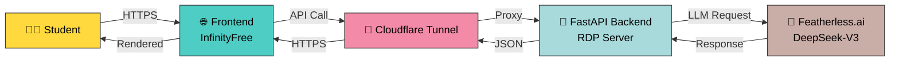

<div align="center">


<br />

<p align="center">
  <a href="https://samiahrafnirob.com/study-dost/">
    
  </a>
  <a href="https://samiahrafnirob.com/">
    
  </a>
  <a href="#-quick-start">
    
  </a>
</p>

<br />

<p align="center">
  
</p>

<br />

<p align="center">
  
  
  
  
  
  
  
</p>

<p align="center">
  
  
  
</p>

</div>

---

<div align="center">

### 🎯 The Problem

> *"Textbooks explain things one way. But every student's brain learns differently."*

### 💡 The Solution

**Study Dost AI** explains any STEM concept in **3 different ways simultaneously** — step-by-step, real-world analogy, and visual cue — so the explanation that clicks with YOU is always one click away.

</div>

<br />

<table align="center">
  <tr>
    <td align="center" width="33%">
      <br />
      <b>3 Explanation Styles</b><br />
      <sub>Step-by-step • Analogy • Visual</sub>
    </td>
    <td align="center" width="33%">
      <br />
      <b>Gamified Learning</b><br />
      <sub>XP • Levels • Badges • Streaks</sub>
    </td>
    <td align="center" width="33%">
      <br />
      <b>Country-Aware</b><br />
      <sub>Bangladesh • India • Global</sub>
    </td>
  </tr>
</table>

---

## 📑 Table of Contents

<details>
<summary><b>🗂 Click to expand</b></summary>

- [✨ Features](#-features)
- [🎬 Live Demo](#-live-demo)
- [🏗 Architecture](#-architecture)
- [⚡ Quick Start](#-quick-start)
- [📦 Deployment](#-deployment)
- [⚙️ Configuration](#%EF%B8%8F-configuration)
- [🧩 Tech Stack](#-tech-stack)
- [🛡 Security](#-security)
- [🎯 Roadmap](#-roadmap)
- [🤝 Contributing](#-contributing)
- [📜 License](#-license)
- [📬 Contact](#-contact)

</details>

---

## ✨ Features

<div align="center">

### 🎓 Core Learning Engine

</div>

<table>
  <tr>
    <td width="50%">
      <h4>🔢 Triple Explanation Engine</h4>
      <p>Get any concept explained <b>3 different ways at once</b>:</p>
      <ul>
        <li>📝 <b>Step-by-Step</b> — methodical walkthrough</li>
        <li>🌍 <b>Real-World Analogy</b> — relatable comparisons</li>
        <li>🎨 <b>Visual Cue</b> — sketchable diagrams</li>
      </ul>
    </td>
    <td width="50%">
      <h4>🎯 Smart Practice Problems</h4>
      <p>AI-generated practice with adaptive difficulty:</p>
      <ul>
        <li>🟢 <b>Easy</b> — concept reinforcement</li>
        <li>🟡 <b>Medium</b> — applied thinking</li>
        <li>🔴 <b>Hard</b> — JEE/NEET/HSC level</li>
      </ul>
    </td>
  </tr>
  <tr>
    <td width="50%">
      <h4>👶 ELI10 Mode</h4>
      <p>"Explain Like I'm 10" — ultra-simple breakdowns when something just isn't clicking. Perfect for breaking through learning blocks.</p>
    </td>
    <td width="50%">
      <h4>🌍 Country-Aware Curriculum</h4>
      <p>Tailored to your education system:</p>
      <ul>
        <li>🇧🇩 NCTB / SSC / HSC / Creative Questions</li>
        <li>🇮🇳 NCERT / CBSE / JEE / NEET</li>
        <li>🌐 International standards</li>
      </ul>
    </td>
  </tr>
</table>

<div align="center">

### 🎮 Gamification System

</div>

<table align="center">
  <tr>
    <td align="center">🏆<br /><b>XP & Levels</b><br /><sub>Level up as you learn</sub></td>
    <td align="center">🔥<br /><b>Daily Streaks</b><br /><sub>Build consistency</sub></td>
    <td align="center">🎖️<br /><b>Achievement Badges</b><br /><sub>Unlock milestones</sub></td>
    <td align="center">🎉<br /><b>Confetti Rewards</b><br /><sub>Celebrate wins</sub></td>
  </tr>
  <tr>
    <td align="center">🐾<br /><b>Pet Mascot</b><br /><sub>Animated companion</sub></td>
    <td align="center">🎨<br /><b>5 Themes</b><br /><sub>Midnight, Cosmic+</sub></td>
    <td align="center">💾<br /><b>Favorites</b><br /><sub>Save explanations</sub></td>
    <td align="center">📝<br /><b>History</b><br /><sub>Auto-saved sessions</sub></td>
  </tr>
</table>

<div align="center">

### 🚀 Advanced Features

</div>

<details>
<summary><b>🎤 Click to see all power features</b></summary>

<br />

| Feature | Description |
|:--------|:------------|
| 🎤 **Voice Input** | Ask questions using speech recognition |
| 🗣️ **Text-to-Speech** | Listen to explanations hands-free |
| 📐 **LaTeX Math** | Beautiful equation rendering with KaTeX |
| 💻 **Code Highlighting** | Syntax-highlighted code blocks |
| 📱 **Mobile-First** | Drawer navigation, touch-optimized |
| ⚡ **Offline-Capable** | localStorage for instant load |
| 🔄 **API Failover** | Multi-key rotation for 99.9% uptime |
| 🛡️ **CORS Protected** | Locked to your domain |
| 🎯 **Suggestion Chips** | Quick-start prompts |
| ♿ **Accessible** | Screen-reader friendly |

</details>

---

## 🎬 Live Demo

<div align="center">

### 🌐 **Try it now → [samiahrafnirob.com/study-dost](https://samiahrafnirob.com/study-dost/)**

<br />

<table>
  <tr>
    <td align="center">
      <br />
      <sub>Best for full experience</sub>
    </td>
    <td align="center">
      <br />
      <sub>Optimized drawer UI</sub>
    </td>
    <td align="center">
      <br />
      <sub>Easy on the eyes</sub>
    </td>
  </tr>
</table>

</div>

---

## 🏗 Architecture

<div align="center">



</div>

### 🧱 Why Split Architecture?

<table>
  <tr>
    <th>Component</th>
    <th>Where It Lives</th>
    <th>Why</th>
  </tr>
  <tr>
    <td>🎨 <b>Frontend</b><br /><sub>HTML/CSS/JS</sub></td>
    <td>InfinityFree, Netlify, GitHub Pages, any static host</td>
    <td>Fast CDN delivery, zero server cost, no build step</td>
  </tr>
  <tr>
    <td>⚙️ <b>Backend</b><br /><sub>FastAPI + Python</sub></td>
    <td>RDP / VPS / Cloud VM</td>
    <td>Hides API keys, full Python ecosystem, scalable</td>
  </tr>
  <tr>
    <td>🔌 <b>Connection</b></td>
    <td>Cloudflare Tunnel (HTTPS)</td>
    <td>Free HTTPS, no port forwarding, DDoS protected</td>
  </tr>
</table>

### 📁 Project Structure

<details>
<summary><b>📂 Click to view full directory tree</b></summary>

```
study-dost-ai/
│
├── 🎨 frontend/                    # Static web app (deploy anywhere)
│   ├── index.html                  # Main app shell
│   ├── styles.css                  # Themes + responsive design
│   ├── app.js                      # Application logic
│   ├── config.js                   # Backend URL configuration
│   └── README.md                   # Frontend docs
│
├── ⚙️  backend/                    # FastAPI service
│   ├── main.py                     # API endpoints + CORS
│   ├── utils.py                    # LLM client + response parser
│   ├── prompts.py                  # Prompt templates
│   ├── requirements.txt            # Python dependencies
│   ├── install.bat                 # Windows installer
│   ├── start.bat                   # Windows launcher
│   ├── .env.example                # Config template
│   └── README.md                   # Backend docs
│
├── 🌐 infinityfree/                # InfinityFree-ready bundle
│   └── (same as frontend/)
│
├── 🖥️  rdp/                        # RDP deployment bundle
│   └── (same as backend/)
│
├── 📜 LICENSE                      # MIT License
├── 📖 README.md                    # You are here ✨
├── 📘 GIT_SETUP_GUIDE.md           # Git + GitHub walkthrough
└── 🚫 .gitignore                   # Protects your secrets
```

</details>

---

## ⚡ Quick Start

<div align="center">

### Get running in **5 minutes** ⏱️

</div>

### 📋 Prerequisites

<table>
  <tr>
    <td>🐍</td>
    <td><a href="https://python.org/downloads/">Python 3.10+</a></td>
  </tr>
  <tr>
    <td>🔑</td>
    <td><a href="https://featherless.ai">Featherless.ai API Key</a> (free tier available)</td>
  </tr>
  <tr>
    <td>🌐</td>
    <td>Any web browser</td>
  </tr>
</table>

### 🚀 Installation

<details open>
<summary><b>🔧 Step 1: Clone the repository</b></summary>

```bash
git clone https://github.com/samiahrafnirob/study-dost-ai.git
cd study-dost-ai
```

</details>

<details>
<summary><b>⚙️ Step 2: Set up the backend</b></summary>

```powershell
cd backend

# Create virtual environment
python -m venv .venv
.\.venv\Scripts\Activate.ps1     # Windows PowerShell
# source .venv/bin/activate       # macOS/Linux

# Install dependencies
pip install -r requirements.txt

# Configure environment
copy .env.example .env
# Edit .env → paste your FEATHERLESS_API_KEY

# Launch server 🚀
python main.py
```

✅ Backend running at `http://localhost:8000`  
📖 Swagger docs at `http://localhost:8000/docs`

</details>

<details>
<summary><b>🎨 Step 3: Launch the frontend</b></summary>

```powershell
cd ../frontend

# Edit config.js
# window.CC_CONFIG = {
#   API_BASE: "http://localhost:8000",
#   API_KEY: ""
# };

# Serve locally
python -m http.server 5500
```

✅ Open `http://localhost:5500` in your browser 🎉

</details>

---

## 📦 Deployment

<div align="center">

Choose your deployment combo:

</div>

<table>
  <tr>
    <th width="33%">🎨 Frontend Host</th>
    <th width="33%">⚙️ Backend Host</th>
    <th width="33%">🔗 HTTPS Bridge</th>
  </tr>
  <tr>
    <td>
      ✅ InfinityFree<br />
      ✅ Netlify<br />
      ✅ Vercel<br />
      ✅ GitHub Pages<br />
      ✅ Cloudflare Pages
    </td>
    <td>
      ✅ Windows RDP<br />
      ✅ Linux VPS<br />
      ✅ AWS EC2<br />
      ✅ DigitalOcean<br />
      ✅ Railway / Render
    </td>
    <td>
      ✅ Cloudflare Tunnel<br />
      ✅ Caddy (auto-HTTPS)<br />
      ✅ Nginx + Certbot<br />
      ✅ ngrok<br />
      ✅ Tailscale Funnel
    </td>
  </tr>
</table>

### 🖥️ Deploy Backend on Windows RDP

<details>
<summary><b>📝 Click for full RDP deployment guide</b></summary>

```powershell
# 1. Copy the rdp/ folder to your RDP
# 2. Install dependencies
.\install.bat

# 3. Configure .env
notepad .env

# 4. Launch the server
.\start.bat

# 5. Expose with Cloudflare Tunnel (free HTTPS)
Invoke-WebRequest `
  -Uri "https://github.com/cloudflare/cloudflared/releases/latest/download/cloudflared-windows-amd64.exe" `
  -OutFile "$env:USERPROFILE\cloudflared.exe"

& "$env:USERPROFILE\cloudflared.exe" tunnel --url http://localhost:8000
# → Copy the https://xxxxx.trycloudflare.com URL
```

Then paste that URL into `frontend/config.js` as your `API_BASE`. Done! 🎉

</details>

### 🌐 Deploy Frontend on InfinityFree

<details>
<summary><b>📝 Click for full InfinityFree deployment guide</b></summary>

1. **Sign up** at [infinityfree.net](https://infinityfree.net)
2. **Create site**: `samiahrafnirob.com/study-dost/`
3. **Upload** all files from `infinityfree/` to `htdocs/study-dost/` via FTP
4. **Edit** `config.js` on the server to point to your backend HTTPS URL
5. **Visit** your live site → 🎊

```js
// infinityfree/config.js
window.CC_CONFIG = {
  API_BASE: "https://your-cloudflare-tunnel-url.trycloudflare.com",
  API_KEY: ""  // optional, must match backend APP_API_KEY
};
```

</details>

---

## ⚙️ Configuration

<details>
<summary><b>🔐 Backend <code>.env</code> file</b></summary>

```env
# 🔑 REQUIRED: Featherless.ai API key
FEATHERLESS_API_KEY=rc_your_api_key_here

# 🔄 OPTIONAL: Backup keys for failover
FEATHERLESS_API_KEY_BACKUP=rc_backup_key_1
FEATHERLESS_API_KEY_BACKUP_2=rc_backup_key_2

# 🛡️ OPTIONAL: App-level authentication
APP_API_KEY=your_optional_shared_secret

# 🌐 CORS: Comma-separated allowed origins
ALLOWED_ORIGINS=https://samiahrafnirob.com,http://localhost:5500

# 🚀 Server settings
PORT=8000
HOST=0.0.0.0
```

</details>

<details>
<summary><b>🎨 Frontend <code>config.js</code> file</b></summary>

```js
window.CC_CONFIG = {
  // Your backend's HTTPS URL
  API_BASE: "https://your-backend-url.com",
  
  // Must match backend's APP_API_KEY (if set)
  API_KEY: "",
  
  // Default country: "default" | "bangladesh" | "india"
  DEFAULT_COUNTRY: "default",
  
  // Default theme: "midnight" | "cosmic" | "sunset" | "forest" | "light"
  DEFAULT_THEME: "midnight"
};
```

</details>

---

## 🧩 Tech Stack

<div align="center">

### 🛠️ Built With

<table>
  <tr>
    <td align="center" width="120">
      <br />
      <b>Python 3.10+</b>
    </td>
    <td align="center" width="120">
      <br />
      <b>FastAPI</b>
    </td>
    <td align="center" width="120">
      <br />
      <b>JavaScript</b>
    </td>
    <td align="center" width="120">
      <br />
      <b>HTML5</b>
    </td>
    <td align="center" width="120">
      <br />
      <b>CSS3</b>
    </td>
  </tr>
  <tr>
    <td align="center">
      <br />
      <b>Uvicorn</b>
    </td>
    <td align="center">
      <br />
      <b>Cloudflare</b>
    </td>
    <td align="center">
      <br />
      <b>OpenAI SDK</b>
    </td>
    <td align="center">
      <br />
      <b>KaTeX</b>
    </td>
    <td align="center">
      <br />
      <b>Marked.js</b>
    </td>
  </tr>
</table>

</div>

<details>
<summary><b>📊 Full dependency breakdown</b></summary>

| Layer | Library | Purpose |
|:------|:--------|:--------|
| Backend | FastAPI | Web framework |
| Backend | Uvicorn | ASGI server |
| Backend | OpenAI SDK | Featherless API client |
| Backend | python-dotenv | Env var loading |
| Backend | Pydantic | Data validation |
| Frontend | marked.js | Markdown rendering |
| Frontend | DOMPurify | XSS protection |
| Frontend | KaTeX | LaTeX math rendering |
| Frontend | highlight.js | Code syntax highlighting |
| AI | DeepSeek-V3-0324 | Language model |
| Hosting | Cloudflare Tunnel | HTTPS exposure |

</details>

---

## 🛡 Security

<table>
  <tr>
    <td>🔐</td>
    <td><b>API keys never reach the browser</b> — they live only in the backend <code>.env</code></td>
  </tr>
  <tr>
    <td>🌐</td>
    <td><b>CORS locked</b> to your domain via <code>ALLOWED_ORIGINS</code></td>
  </tr>
  <tr>
    <td>🔑</td>
    <td><b>Optional shared secret</b> (<code>APP_API_KEY</code>) for extra auth layer</td>
  </tr>
  <tr>
    <td>🔒</td>
    <td><b>HTTPS enforced</b> via Cloudflare Tunnel / Caddy</td>
  </tr>
  <tr>
    <td>🧹</td>
    <td><b>Input sanitized</b> with DOMPurify before rendering</td>
  </tr>
  <tr>
    <td>🚫</td>
    <td><b><code>.env</code> always gitignored</b> — no leaks ever</td>
  </tr>
</table>

---

## 🎯 Roadmap

<table>
  <tr>
    <th>Status</th>
    <th>Feature</th>
    <th>Target</th>
  </tr>
  <tr><td>✅</td><td>Triple explanation engine</td><td>v1.0</td></tr>
  <tr><td>✅</td><td>Country-aware curriculum</td><td>v1.0</td></tr>
  <tr><td>✅</td><td>Gamification (XP, badges)</td><td>v1.0</td></tr>
  <tr><td>✅</td><td>Mobile responsive UI</td><td>v1.0</td></tr>
  <tr><td>✅</td><td>Voice input/output</td><td>v1.0</td></tr>
  <tr><td>🚧</td><td>Multi-language UI (Bengali, Hindi)</td><td>v1.1</td></tr>
  <tr><td>📋</td><td>User accounts + cloud sync</td><td>v1.2</td></tr>
  <tr><td>📋</td><td>PDF export for notes</td><td>v1.2</td></tr>
  <tr><td>📋</td><td>Quiz mode with leaderboards</td><td>v1.3</td></tr>
  <tr><td>📋</td><td>Collaborative study rooms</td><td>v2.0</td></tr>
  <tr><td>📋</td><td>Native mobile apps</td><td>v2.0</td></tr>
</table>

---

## 🤝 Contributing

<div align="center">

**All contributions are welcome!** 🎉

</div>

<details>
<summary><b>🔧 How to contribute</b></summary>

1. **Fork** the repository
2. **Create** your feature branch
   ```bash
   git checkout -b feature/AmazingFeature
   ```
3. **Commit** your changes
   ```bash
   git commit -m "feat: add AmazingFeature"
   ```
4. **Push** to the branch
   ```bash
   git push origin feature/AmazingFeature
   ```
5. **Open** a Pull Request

### 📝 Commit Convention

We follow [Conventional Commits](https://www.conventionalcommits.org/):

- `feat:` New feature
- `fix:` Bug fix
- `docs:` Documentation
- `style:` Formatting
- `refactor:` Code restructure
- `test:` Tests
- `chore:` Maintenance

</details>

---

## 📜 License

<div align="center">

This project is licensed under the **MIT License** — see [LICENSE](LICENSE) for details.

```
Copyright (c) 2026 Sami Ahraf Nirob
```

You are free to use, modify, and distribute this software. 🎉

</div>

---

## 📬 Contact

<div align="center">

### 👨‍💻 Sami Ahraf Nirob

<br />

<a href="https://samiahrafnirob.com/">
  
</a>
<a href="https://samiahrafnirob.com/study-dost/">
  
</a>
<br />
<a href="mailto:contact@samiahrafnirob.com">
  
</a>
<a href="https://linkedin.com/in/samiahrafnirob">
  
</a>
<a href="https://github.com/samiahrafnirob">
  
</a>

</div>

---

## 🌟 Show Your Support

<div align="center">

If this project helped you, please consider:

⭐ **Starring this repo**  
🐦 **Sharing on social media**  
🐛 **Reporting bugs**  
💡 **Suggesting features**  
🤝 **Contributing code**

<br />


&nbsp; **Built with passion for students worldwide** &nbsp;


</div>

---

<div align="center">


<sub>Made with ❤️ by <a href="https://samiahrafnirob.com/">Sami Ahraf Nirob</a> · © 2026 · MIT License</sub>

<br />

<a href="#-study-dost-ai"></a>

</div>
